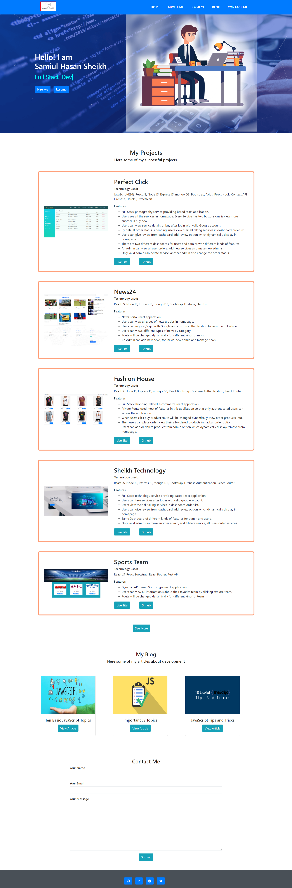
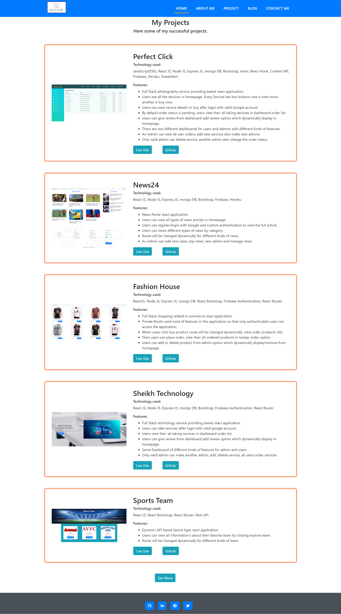

# Samiul Sheikh Portfolio

## my personal react portfolio site.

### `Technology Used`
- JavaScript (ES6)
- React JS
- Bootstrap
- Axios
- React Router
- React Hook
- Particles JS
- FontAwesomeIcon
---
## :link: [See live project here](https://sheikh-samiul.web.app/)

---
### `Project Features`
- Professional looks UI design.
- Different kinds of section like - projects, blog, about me, contact with email features.
- View my all projects with live site and source code.
- Learning new technologies day by day & increase my skills as a professional Software Engineer.
- Target in 2022 learning TypeScript & NextJS also solve 100+ problem in HackerRank.
### `Project UI`

